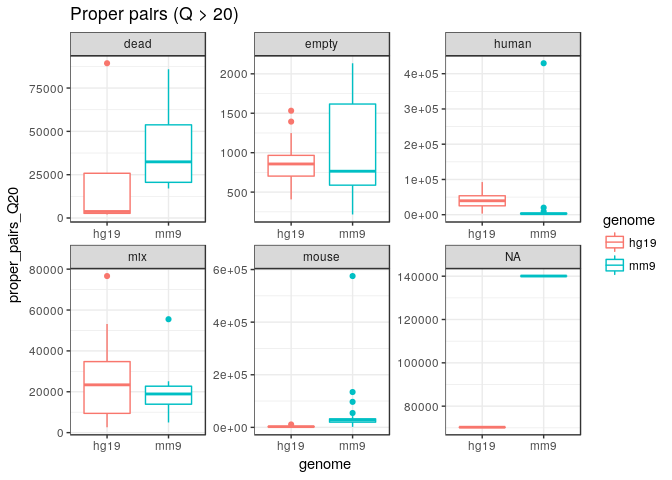
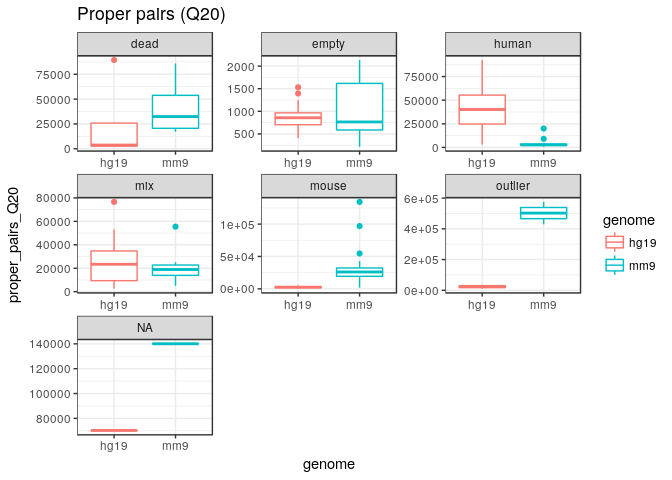

# ATAC-seq run 161026_M00528_0239_000000000-ANY8K

C1 ATAC-seq run `1772-123-148`.

Example view: <http://fantom.gsc.riken.jp/zenbu/gLyphs/#config=BPtVEC-RHN9rOOmRJd_MOC>.


## Analysis in R

### Library information.


```r
LIBRARY      <- "161026_M00528_0239_000000000-ANY8K"
RunA         <- "1772-123-148"
```

### Load R packages.


```r
library("magrittr")
library("smallCAGEqc")
library("ggplot2")
library("platetools")
library("viridis")
```

### Create summary table


```r
libs <- data.frame(Well=platetools::num_to_well(1:96), stringsAsFactors = FALSE)
libs$Run <- RunA
libs$Run <- factor(libs$Run)
libs$Row <- sub(".", "", libs$Well) %>% factor
libs$Col <- sub("..$", "", libs$Well) %>% factor
libs$Chamber <- fldgmChamberWell(libs$Well)
rownames(libs) <- paste(RunA, libs$Well, sep="_")
libs$samplename <- rownames(libs)
```

### Load color data


```r
getCuration <- function(colnumber)
  gdata::read.xls( "1772-123-148_cell-count.xlsx"
                 , head = FALSE
                 , stringsAsFactors = FALSE)[[colnumber]]

libs[paste(RunA, fldgmChamberWell( 1:48), sep="_"), "Cell"] <- getCuration(2)
libs[paste(RunA, fldgmChamberWell(49:96), sep="_"), "Cell"] <- getCuration(6)

assignGroup <- function (pattern, group)
  libs[grep(pattern, libs$Cell), "Group"] <<- group

libs$Group <- ""
assignGroup("R",     "mouse")
assignGroup("G",    "human")
assignGroup("GR",    "mix")
assignGroup("empty", "empty")
assignGroup("Dead",  "dead")
libs$Group %<>% factor
```

### Load alignment statistics


```r
loadTriples <- function(pattern='*\\.log') {
  logfiles <- list.files(path='.', pattern=pattern)
  df <- data.frame( variable   = factor()
                  , samplename = factor()
                  , value      = numeric())
  for (logfile in logfiles) {
      df <- rbind(df, read.table(logfile, col.names=colnames(df)))
  }
  df <- reshape::cast(df)
  rownames(df) <- df$samplename
  return(df)
}

alStats <- loadTriples(paste0(LIBRARY, ".*.log"))
alStats$genome <- sub(".*_", "", rownames(alStats))
alStats$samplename %<>% sub(pat="_(mm9|hg19)", rep="")

libs %<>% merge(alStats, by="samplename", all=TRUE)
rm(alStats)
```


```r
libs[libs$genome=="hg19", "h_m_ratio"] <-
  libs[libs$genome=="mm9", "h_m_ratio"] <-
    log(libs[libs$genome=="hg19", "proper_pairs"] /
        libs[libs$genome=="mm9", "proper_pairs"])
```

### Comparisons


```r
qplot(data = libs, genome, proper_pairs,  geom = "boxplot", color=genome) + ggtitle('Proper pairs') + facet_wrap(~Group, scale="free")
```

<!-- -->

```r
qplot(data = libs, genome, proper_pairs_Q20,  geom = "boxplot", color=genome) + ggtitle('Proper pairs (Q > 20)') + facet_wrap(~Group, scale="free")
```

<!-- -->

```r
qplot(data = libs, genome, redundancy,  geom = "boxplot", color=genome) + ggtitle('Redundancy') + facet_wrap(~Group, scale="free")
```

<!-- -->

```r
qplot(data = libs, genome, redundancy2,  geom = "boxplot", color=genome) + ggtitle('Redundancy (proper pairs only)') + facet_wrap(~Group, scale="free")
```

<!-- -->

Samples F09 and H02 gave very large number of aligned pairs on the mouse
genome.  For the purpose of better comparing the other samples, the plots
below move them to a "outliers" category.


```r
local({
libs$Group %<>% as.character
libs[grepl("(F09|H02)", libs$samplename), "Group"] <- "outlier"
libs$Group %<>% factor
qplot(data = libs, genome, proper_pairs_Q20,  geom = "boxplot", color=genome) + ggtitle('Proper pairs (Q20)') + facet_wrap(~Group, scale="free")
})
```

<!-- -->


```r
libsM <- libs[libs$genome == "mm9", ][1:96,]
libsH <- libs[libs$genome == "hg19",][1:96,]

raw_map(libsM$Group %>% as.character, well=libsM$Well) +
  ggtitle("Group")
```

<!-- -->

```r
raw_map(libsM$proper_pairs %>% log, well=libsM$Well) +
  ggtitle("Proper pairs (log), mouse") + 
  scale_fill_viridis()
```

<!-- -->

```r
raw_map(libsH$proper_pairs %>% log, well=libsH$Well) +
  ggtitle("Proper pairs (log), human") + 
  scale_fill_viridis()
```

<!-- -->

```r
raw_map(libsM$redundancy, well=libsM$Well) +
  ggtitle("Redundancy, mouse") + 
  scale_fill_viridis()
```

<!-- -->

```r
raw_map(libsH$redundancy, well=libsH$Well) +
  ggtitle("Redundancy, human") + 
  scale_fill_viridis()
```

<!-- -->

```r
plot(libsM$redundancy, libsM$proper_pairs, log="y", col=libsM$Group %>% as.numeric + 1)
abline(h=1e4, col="red")
abline(v=0.7, col="red")
```

<!-- -->

```r
plot(libsH$redundancy, libsH$proper_pairs, log="y", col=libsH$Group %>% as.numeric + 1)

abline(h=1e4, col="red")
abline(v=0.7, col="red")
```

<!-- -->

```r
boxplot(data = libs, proper_pairs ~ Group)
```

<!-- -->

```r
boxplot(data = libs, redundancy ~ Group)
```

<!-- -->

#### Human / mouse ratio of aligned pairs.


```r
qplot(data = libs[libs$genome=="hg19",], Group, h_m_ratio,  geom = "boxplot", color=Group) + ggtitle('log ratio human/mouse alignments') + geom_jitter() + coord_flip()
```

<!-- -->

Upload libraries on Zenbu
-------------------------

```
library(zenbuWrappeR)

rownames(libs) <- paste0(libs$samplename, "_", libs$genome)

samplesToUpload <- rownames(libs)

sampleDescription <- Vectorize(
  function(sample)
    paste(sample, LIBRARY, "ATAC", "knitrUpload", "upload1")
)

sampleUploadTable <-
 data.frame( fullPath    = paste0( getwd()
                                 , "/"
                                 , LIBRARY
                                 , "/"
                                 , samplesToUpload
                                 , ".bed")
           , displayName = samplesToUpload
           , description = sampleDescription(samplesToUpload)
)

write.table(
   sampleUploadTable
 , file = paste0(LIBRARY, ".zUpload.tsv")
 , quote=FALSE
 , sep="\t"
 , row.names = FALSE
 , col.names = FALSE)

ASSEMBLY <- "mm9"
# 
# zenbuUpload( "-assembly", ASSEMBLY
#            , "-filelist", paste0(LIBRARY, ".zUpload.tsv")
#            , "-collab_uuid", ZENBU_COLLAB
#            , "-singletag_exp")

ASSEMBLY <- "hg19"
# 
# zenbuUpload( "-assembly", ASSEMBLY
#            , "-filelist", paste0(LIBRARY, ".zUpload.tsv")
#            , "-collab_uuid", ZENBU_COLLAB
#            , "-singletag_exp")

# Wait for the data to be loaded...

# Need to share again, since the sharing of some samples failed.
# 
# zenbuUpload( "-list"
#            , "-filter"
#            , LIBRARY
#            , "-share"
#            , ZENBU_COLLAB)

tagMetaTable <- function(Key)
 data.frame(
   filter  = sampleDescription(rownames(libs))
 , command = "add"
 , key     = Key
 , value   = libs[[Key]] %>% as.character
 , stringsAsFactors = FALSE
 )

mkMetaTable <- function(Keys) {
 if (! all( Keys %in% colnames(libs)))
   stop("Some keys are not in the libs table")
 Reduce(
     function(DF, Key) rbind(DF, tagMetaTable(Key))
   , Keys
   , data.frame() )
}

metaToTag <- c(
   "Run", "Row", "Chamber"
  , "Group"
  , "genome")

write.table(
   mkMetaTable(metaToTag)
 , file      = paste0(LIBRARY, ".zMeta.tsv")
 , quote     = FALSE
 , sep       = "\t"
 , row.names = FALSE
 , col.names = FALSE)
# 
# zenbuUpload( "-mdfile"
#            , paste0(LIBRARY, ".zMeta.tsv"))
```
